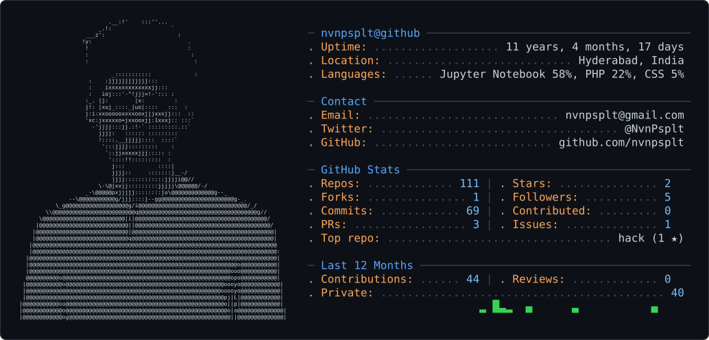

<!-- dark_mode.svg / light_mode.svg are generated by .github/workflows/profile-card.yml -->
<picture>
  <source media="(prefers-color-scheme: dark)" srcset="dark_mode.svg" />
  <source media="(prefers-color-scheme: light)" srcset="light_mode.svg" />
  
</picture>
